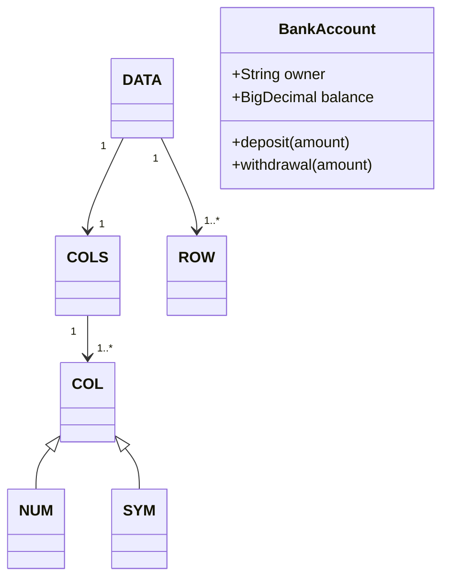

<p>&nbsp;
<a name=top></a>
<table><tr>
<td><a href="/README.md#top">Home</a>
<td><a href="http:github.com/timm/tested/issues">issues</a>
</tr></table>
</p>
<p> <a
href="https://github.com/timm/tested/actions/workflows/tests.yml"> </a>   <a 
 href="https://zenodo.org/badge/latestdoi/569981645"> </a><br>
<a href="/LICENSE.md">&copy;2022,2023</a> by <a href="http://menzies.us">Tim Menzies</a></p>


# Automated SE: Scripting Tricks

Here are the parts of my code:

- LUA
- domain-specific languages
  - command-line script
  - test-driven development

## About LUA

LUA is an ultra lightweight scripting language comprising less than
two dozen keywords: **and, break, do, else, elseif, end, false, for, function, if, in, local, nil, not, or, repeat, return, then, true, until, while**.  
LUA has a considerably smaller footprint
than other programming languages
(with its complete source code and
documentation taking a mere 1.3 MB). 

I use LUA as an executable specification language. Students rewrite
my code in whatever language they like (that is not LUA).  

- For quick tutorials on LUA, see  [learnlua](https://learnxinyminutes.com/docs/lua/)
- For full details on LUA, see the [Programming in LUA](https://www.lua.org/pil/contents.html) book.

## Domain-Specific Languages


My code uses several shorthand notations.

### Help String to Options
The code using options whose defaults are defined and extracted from
a help string (offered at start of file):

```lua
local the,help={},[[  
fish1,lua : sort many <X,Y> things on Y, after peeking at just a few Y things
(c)2022 Tim Menzies <timm@ieee.org> BSD-2

Note: fish1 is just a demonststraing of this kind of processing.
It is designed to be incomplete, to have flaws. If you look at this
case say say "a better way to do this wuld be XYZ", then fish1 has
been successful.

USAGE: lua fish1.lua [OPTIONS] [-g [ACTIONS

OPTIONS:
  -b  --budget  number of evaluations = 16
  -f  --file    csv data file         = ../etc/data/auto93.csv
  -g  --go      start up action       = ls
  -h  --help    show help             = false
  -p  --p       distance coefficient  = 2
  -s  --seed    random number seed    = 10019

ACTIONS:
]] 
```
The  parser is simple (using some regular expression captures):

```lua
function settings(s,    t) 
  -- e.g.             -h           --help show help   = false
  t={};s:gsub("\n[%s]+[-][%S]+[%s]+[-][-]([%S]+)[^\n]+= ([%S]+)",
              function(k,v) t[k]=coerce(v) end)
  return t end

function coerce(s,    fun)
  function fun(s1)
    if s1=="true" then return true elseif s1=="false" then return false end
    return s1 end
  return math.tointeger(s) or tonumber(s) or fun(s:match"^%s*(.-)%s*$") end
```
The default settings can also be updated via the command-line
(which in LUA can be found in the `args` array):

```lua
function cli(options) 
  for k,v in pairs(options) do
    v=tostring(v)
    for n,x in ipairs(arg) do
      if x=="-"..(k:sub(1,1)) or x=="--"..k then
         v = v=="false" and "true" or v=="true" and "false" or arg[n+1] end end
    options[k] = coerce(v) end 
  return options end

the = cli(settings(help))
```
Note one short cut in the above:
- when the `cli` function looks for update, 
  - if the default is non-boolean then the flag `-x` must be followed by a value
  - if the default is a boolean, then the flag `-x` has no value
    (and the default is just inverted)

### CSV with Named Columns

My CSV parser learns some details about columns using the column
headers:
```
Clndrs,Volume, Hpx,  Lbs-,  Acc+,  Model, origin, Mpg+
4,      97,     52,  2130,  24.6,  82,    2,      40
4,      97,     54,  2254,  23.5,  72,    2,      20
4,      97,     78,  2188,  15.8,  80,    2,      30
4,     151,     90,  2950,  17.3,  82,    1,      30
6,     200,     ?,   2875,  17,    74,    1,      20
6,     146,     97,  2815,  14.5,  77,    3,      20
8,     267,    125,  3605,  15,    79,    1,      20
8,     307,    130,  4098,  14,    72,    1,      10
```
I'm these names:
- we skip columns whose names end in `X`;
- if the name starts in uppercase, we have a number
- if the name ends with "-" or "+" then its a goal we want to minimize or maximize
  - and for such items, we will set "w" to 1.

```
list of names      call                 weight    goal?
--------------     ----------------     ------    -----

{ "Clndrs",        NUM(1, "Clndrs")     1         n
  "Volume",        NUM(2, "Volume")     1         n
  "HpX",           NUM(3, "HpX")        1         n
  "Lbs-",          NUM(4, "Lbs-")         -1         y
  "Acc+",          NUM(5, "Acc+")       1            y
  "Model",         NUM(6, "Model")      1         n
  "origin",        SYM(7, "origin")               n
  "Mpg+"}          NUM(8, "Mgp+")       1            y
```
So the these CSV first line gets processed by a factory
that generates a set of goals `i.y` and other columns `i.x`:
```lua
COLS=obj"COLS"
function COLS.new(i,t,     col,cols)
  i.names, i.all, i.x, i.y = t, {}, {}, {}
  for n,s in pairs(t) do  -- like PYTHONS's for n,s in enumerate(t) do..
    col = s:find"^[A-Z]+" and NUM(n,s) or SYM(n,s)
    push(i.all, col)
    if not s:find"X$" then
      push(s:find"[!+-]$" and i.y or i.x, col) end end end
```
### The DATA Model


